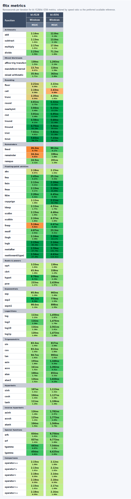

<p align="center">
  <br>
  Extended-precision floating point and constexpr math for C++23<br>
  Fast · Precise · Lightweight
</p>

[](https://github.com/willmh93/fltx/actions/workflows/precision-tests-linux.yml)
[](https://github.com/willmh93/fltx/actions/workflows/precision-tests-windows.yml)
[](https://github.com/willmh93/fltx/actions/workflows/precision-tests-mac.yml)
[](https://github.com/willmh93/fltx/actions/workflows/precision-tests-wasm32.yml)
[](https://github.com/willmh93/fltx/actions/workflows/parity-tests-linux.yml)
[](https://github.com/willmh93/fltx/actions/workflows/parity-tests-windows.yml)
[](https://github.com/willmh93/fltx/actions/workflows/parity-tests-mac.yml)
[](https://github.com/willmh93/fltx/actions/workflows/parity-tests-wasm32.yml)
[](https://github.com/willmh93/fltx/actions/workflows/io-tests-linux.yml)
[](https://github.com/willmh93/fltx/actions/workflows/io-tests-windows.yml)
[](https://github.com/willmh93/fltx/actions/workflows/io-tests-mac.yml)
[](https://github.com/willmh93/fltx/actions/workflows/io-tests-wasm32.yml)

`fltx` is for projects that needs more precision than `double`, without giving up fixed-size scalar types, predictable performance, `constexpr` support, or familiar C++ ergonomics.

## Menu

- [Overview](https://github.com/willmh93/fltx#highlights): highlights and core types
- [Get Started](https://github.com/willmh93/fltx#quick-start): quick start and installation
- [Library Guide](https://github.com/willmh93/fltx#use-cases): use cases, headers, numeric types, math, and IO
- [Advanced Features](https://github.com/willmh93/fltx#f256-expression-fusion): f256 expression fusion and template dispatch
- [Developer](https://github.com/willmh93/fltx#building-fltx): building fltx and running tests
- [Project Details](https://github.com/willmh93/fltx#benchmarks): benchmarks and license

## Highlights

Features:

- Fixed-size extended-precision scalar types: [`bl::f128`](include/fltx/f128.h) and [`bl::f256`](include/fltx/f256.h)
- Full `constexpr` support for arithmetic, comparisons, conversions, parsing, formatting, and all math functions
- A familiar standard-library shaped API; in most cases you can simply replace `std::` with `bl::`
- No required runtime dependencies
- Standard-library integration for IO streams / manipulators, `std::numeric_limits`, `std::numbers`, `std::hash`, `std::format`

Accuracy:

- Accuracy validated against [boost::multiprecision::mpfr_float_backend](https://www.boost.org/doc/libs/latest/libs/multiprecision/doc/html/boost_multiprecision/tut/floats/mpfr_float.html)
- Enable `FLTX_CONSTEXPR_PARITY` for bitwise-identical runtime and `constexpr` results (reduces performance)

Performance:

- Compatible with fast-math builds
- [`bl::f256`](include/fltx/f256.h) has an expression node system which recognises and fuses common arithmetic shapes, reducing intermediate rounding and temporary value materialisation, allowing those shapes to run specialised fused kernels.
- Hardware acceleration where supported, including x86/x64 SSE2 with FMA when available, AArch64 NEON, and WebAssembly `wasm128` SIMD via Emscripten
- Suitable for lightweight native builds, WebAssembly / Emscripten
- Optional runtime-to-compile-time dispatch helper for template-specialized kernels

## Core Types

| Type | Representation | Accuracy |
|---|---|---|
| [`bl::f32`](include/fltx/aliases.h) | Alias for native [`float`](https://en.cppreference.com/w/cpp/language/types) | Native [`float`](https://en.cppreference.com/w/cpp/language/types) precision |
| [`bl::f64`](include/fltx/aliases.h) | Alias for native [`double`](https://en.cppreference.com/w/cpp/language/types) | Native [`double`](https://en.cppreference.com/w/cpp/language/types) precision |
| [`bl::f128`](include/fltx/f128.h) | Double-double, stored as two [`double`](https://en.cppreference.com/w/cpp/language/types) limbs | Minimum 29 decimal digits across arithmetic and math functions |
| [`bl::f256`](include/fltx/f256.h) | Quad-double, stored as four [`double`](https://en.cppreference.com/w/cpp/language/types) limbs | Minimum 59 decimal digits across arithmetic and math functions |

The names refer to storage size:

```text
sizeof(bl::f128) == 16
sizeof(bl::f256) == 32
```

[`bl::f128`](include/fltx/f128.h) and [`bl::f256`](include/fltx/f256.h) are not IEEE [binary128](https://en.wikipedia.org/wiki/Quadruple-precision_floating-point_format#IEEE_754_quadruple-precision_binary_floating-point_format:_binary128) / [binary256](https://en.wikipedia.org/wiki/Octuple-precision_floating-point_format#IEEE_754_octuple-precision_binary_floating-point_format:_binary256) types, and they are not arbitrary-precision numbers.

## Quick Start

```cpp
#include <iostream>
#include <iomanip>

#include <fltx.h>
using namespace bl;
using namespace bl::literals;

int main()
{
    constexpr f256 a = 1_qd / 3_qd;
    constexpr f256 b = 2_qd / 3_qd;
    constexpr f256 c = a + b;
    constexpr f256 d = bl::sin(a + b);

    std::cout
        << std::setprecision(std::numeric_limits<f256>::digits10)
        << "a = " << a << "\n"
        << "b = " << b << "\n"
        << "c = " << c << "\n"
        << "d = " << d << "\n";
}
```

Output:

```text
a = 0.333333333333333333333333333333333333333333333333333333333333333
b = 0.666666666666666666666666666666666666666666666666666666666666667
c = 1
d = 0.84147098480789650665250232163029899962256306079837106567275171
```

More examples are available in [examples/](examples/)

## Installation

### vcpkg

Add the bitloop registry to `vcpkg-configuration.json`, pinning the registry commit you want to consume:

```json
{
  "registries": [
    {
      "kind": "git",
      "baseline": "5504123246482f0bbb58fd53783ae1b1e3fa88f9",
      "repository": "https://github.com/willmh93/bitloop-registry.git",
      "packages": ["fltx"]
    }
  ]
}
```

Then add `fltx` to `vcpkg.json`:

```json
{
  "name": "myapp",
  "version": "1.0.0",
  "dependencies": [
    "fltx"
  ]
}
```

### CMake

With vcpkg:

```cmake
find_package(fltx CONFIG REQUIRED)
target_link_libraries(main PRIVATE fltx::fltx)
```

Or include it directly:

```cmake
add_subdirectory(/path/to/fltx fltx-build)
target_link_libraries(main PRIVATE fltx::fltx)
```

## Use Cases

`fltx` is aimed at workloads where both precision and speed matter:

- simulations and iterative numerical kernels
- geometric transforms
- numerically sensitive reference code
- compile-time validation and test generation
- fixed-size interop boundaries that cannot use arbitrary-precision types

It is a good fit when you want an extended-precision type that can still be passed around like a normal scalar in ordinary C++ code.

## Public Headers

| Header | Provides |
|---|---|
| [`fltx.h`](include/fltx.h) | Umbrella header: Core types, IO, math, random, hashing and template dispatch helper |
| [`fltx/core.h`](include/fltx/core.h) | Core numeric types, storage types, arithmetic, conversions, and numeric integration |
| [`fltx/math.h`](include/fltx/math.h) | Core types plus the `constexpr` Math API |
| [`fltx/io.h`](include/fltx/io.h) | Limits, numbers, `charconv`-shaped helpers, string conversion, stream output, and literals |
| [`fltx/random.h`](include/fltx/random.h) | Standard-shaped random engines and distributions |
| [`fltx/hash.h`](include/fltx/hash.h) | `std::hash` specializations for the extended types |

Individual headers are also available when you want a smaller include surface:

| Header | Provides |
|---|---|
| [`fltx/f128.h`](include/fltx/f128.h)<br>[`fltx/f256.h`](include/fltx/f256.h) | Individual extended-precision types, storage types, and core operations |
| [`fltx/f32_math.h`](include/fltx/f32_math.h)<br>[`fltx/f64_math.h`](include/fltx/f64_math.h)<br>[`fltx/f128_math.h`](include/fltx/f128_math.h)<br>[`fltx/f256_math.h`](include/fltx/f256_math.h) | Math APIs for individual floating-point types |
| [`fltx/f128_io.h`](include/fltx/f128_io.h)<br>[`fltx/f256_io.h`](include/fltx/f256_io.h) | `bl::to_f128`, `bl::to_f256`<br>`bl::to_string`, `bl::to_static_string`, `bl::to_string_collapsed`<br>`_dd` / `_qd` literals |
| [`fltx/charconv.h`](include/fltx/charconv.h) | `bl::to_chars` and `bl::from_chars` for extended types |
| [`fltx/aliases.h`](include/fltx/aliases.h) | Fundamental aliases such as `f32`, `f64`, `f128`, and `f256` |
| [`fltx/traits.h`](include/fltx/traits.h) | Concepts, type traits, `FloatType` enum, and `FloatTypeNames` |
| [`fltx/format.h`](include/fltx/format.h) | Optional `std::formatter` specializations when `<format>` is available |
| [`fltx/dispatch.h`](include/fltx/dispatch.h) | Includes standalone [`fltx/template_dispatch.h`](include/fltx/template_dispatch.h) runtime-to-compile-time dispatch-table helper,<br>plus mappings for `FloatType` values to `f32`, `f64`, `f128`, or `f256` |

## Numeric Types

The main user-facing types are:

```cpp
bl::f32     // float alias
bl::f64     // double alias
bl::f128    // double-double scalar type
bl::f256    // quad-double scalar type

bl::f128_s  // trivial storage form
bl::f256_s  // trivial storage form (no fused-expression support)
```

The trivial storage forms are useful when standard-layout storage matters, such as packed structures, unions, binary buffers, or interop boundaries. They convert cleanly to and from the full scalar types.

```cpp
bl::f128_s a { 5.0 }; // storage forms are trivially constructible
bl::f128   b = 5.0f;  // full scalar type

bl::f128_s c = a + b;
bl::f128   d = c;
```

Common type concepts and traits are available from [`fltx/traits.h`](include/fltx/traits.h):

```cpp
bl::fltx_f32<T>                  // true for bl::f32
bl::fltx_f64<T>                  // true for bl::f64
bl::fltx_f128<T>                 // true for bl::f128 or bl::f128_s
bl::fltx_f256<T>                 // true for bl::f256 or bl::f256_s

bl::fltx_extended_float<T>       // true for fltx f128/f256 scalar or storage types
bl::fltx_float<T>                // true for the fltx float family: f32, f64, f128, or f256
bl::fltx_arithmetic<T>           // true for native arithmetic or fltx extended floats

bl::is_f32_v<T>                  // bool-value form of bl::fltx_f32<T>
bl::is_f64_v<T>                  // bool-value form of bl::fltx_f64<T>
bl::is_f128_v<T>                 // bool-value form of bl::fltx_f128<T>
bl::is_f256_v<T>                 // bool-value form of bl::fltx_f256<T>

bl::is_fltx_extended_float_v<T>  // bool-value form of bl::fltx_extended_float<T>
bl::is_fltx_float_v<T>           // bool-value form of bl::fltx_float<T>
bl::is_arithmetic_v<T>           // bool-value form of bl::fltx_arithmetic<T>
bl::is_integral_v<T>             // true for native integral types (for consistency)
```

## Math API

[`fltx/math.h`](include/fltx/math.h) provides a `constexpr` interface modeled after the `<cmath>` API across [`bl::f32`](include/fltx/aliases.h), [`bl::f64`](include/fltx/aliases.h), [`bl::f128`](include/fltx/f128.h), and [`bl::f256`](include/fltx/f256.h).

This lets generic numeric code switch precision without changing its math calls:

```cpp
template<class T>
constexpr T radius(T x, T y)
{
    return bl::sqrt(x * x + y * y);
}

using namespace bl::literals;

constexpr bl::f32   a = radius(1.0f, 2.0f);
constexpr bl::f64   b = radius(1.0,  2.0);
constexpr bl::f128  c = radius(1.0_dd, 2.0_dd);
constexpr bl::f256  d = radius(1.0_qd, 2.0_qd);
```

Supported function groups:

| constexpr | Category | Functions |
|---|---|---|
| ✅ | Arithmetic | `abs`, `fabs`, `fma` |
| ✅ | Rounding | `floor`, `ceil`, `trunc`, `round`, `lround`, `llround`, `nearbyint`, `rint`, `lrint`, `llrint` |
| ✅ | Remainders | `fmod`, `remainder`, `remquo` |
| ✅ | Min / max / sign | `fmin`, `fmax`, `fdim`, `copysign`, `signbit` |
| ✅ | Roots / powers | `sqrt`, `cbrt`, `hypot`, `pow` |
| ✅ | Exp / log | `exp`, `exp2`, `expm1`, `log`, `log2`, `log10`, `log1p`, `logb`, `ilogb` |
| ✅ | Trigonometry | `sin`, `cos`, `tan`, `sincos`, `asin`, `acos`, `atan`, `atan2` |
| ✅ | Hyperbolic | `sinh`, `cosh`, `tanh`, `asinh`, `acosh`, `atanh` |
| ✅ | Special functions | `erf`, `erfc`, `lgamma`, `tgamma` |
| ✅ | Classification / comparison | `fpclassify`, `isfinite`, `isinf`, `isnan`, `isnormal`, `isunordered`, `isgreater`, `isgreaterequal`, `isless`, `islessequal`, `islessgreater`, `iszero` |
| ✅ | Scaling / layout | `ldexp`, `scalbn`, `scalbln`, `frexp`, `modf`, `nextafter`, `nexttoward` |


## IO and Literals

[`fltx/io.h`](include/fltx/io.h) adds `constexpr`-capable parsing, formatting, stream output, string conversion, and the `_dd` / `_qd` literals:

```cpp
using namespace bl::literals;

constexpr f128 a = 1.25_dd;
constexpr f256 b = 3.1415926535897932384626433832795028841971_qd;

constexpr auto s1 = bl::to_static_string(b);  // static_string<512>
std::string s2    = bl::to_string(b);
```

Stream output supports `std::setprecision`, `std::fixed`, `std::scientific`, `std::showpoint`, `std::showpos`, and `std::uppercase`.

For buffer-oriented code, [`fltx/charconv.h`](include/fltx/charconv.h) provides `bl::to_chars` and `bl::from_chars` overloads for extended types. Include [`fltx/format.h`](include/fltx/format.h) when you want `std::format` support on standard libraries that provide `<format>`.

## f256 Expression Fusion

[`bl::f256`](include/fltx/f256.h) has an expression node system which recognises common arithmetic shapes, including product sums, dot-product-plus-bias expressions, and scaled linear combinations.

For example:

```cpp
f256 r = a * b + c * d + e;
```

is kept as a small compile-time expression and lowered to the existing fused product-sum body. This avoids materialising and normalising each intermediate quad-double result before the final value is needed.

The matcher also accepts selected equivalent spellings, such as reordered product/value terms and scaled linear forms. That gives common kernels like affine transforms, small matrix-vector operations, polynomial-style updates, and recurrence relations a faster path without requiring users to call specialised helpers or the implementation to maintain a full symbolic optimiser.

The fused bodies remain explicit and bounded, which keeps compile-time and code-size costs under control.

## Template Dispatch

[`fltx/dispatch.h`](include/fltx/dispatch.h) includes a small runtime-to-template dispatch layer.

This lets runtime values such as [`FloatType::F128`](include/fltx/traits.h) or [`FloatType::F256`](include/fltx/traits.h) select a compile-time type, so the called function still compiles as a normal template specialization.

```cpp
#include <iostream>
#include <fltx.h>

using namespace bl;

template<class T>
void run_kernel(int width, int height)
{
    T x = T{ width } / T{ height };
    T y = bl::sqrt(x) + bl::sin(x);

    std::cout << y << '\n';
}

int main()
{
    FloatType precision = FloatType::F256;

    bl_table_invoke(
        bl_dispatch_table(run_kernel, 1920, 1080),
        bl_enum_type(precision)
    );
}
```

<details>
<summary>Mapping a custom enum to a compile-time type</summary>

[`fltx/template_dispatch.h`](include/fltx/template_dispatch.h) is the lower-level dispatch utility used by [`fltx/dispatch.h`](include/fltx/dispatch.h). It can also be used directly when you want your own runtime enum to select one of several compile-time types:

```cpp
#include <fltx/template_dispatch.h>

enum struct Backend { Cpu, Gpu, COUNT };

struct CpuBackend {};
struct GpuBackend {};

bl_map_enum_to_type(Backend::Cpu, CpuBackend);
bl_map_enum_to_type(Backend::Gpu, GpuBackend);

template<class BackendT, bool Debug>
void run()
{
    if constexpr (Debug)
    {
        // Debug-only path.
    }
}

int main()
{
    Backend backend = Backend::Gpu;
    bool debug = true;

    bl_table_invoke(
        bl_dispatch_table(run),
        bl_enum_type(backend),
        debug
    );
}
```

</details>

## Building fltx

These steps are for contributors who want to build the `fltx` repository itself, including tests and benchmarks. They install the repo-local vcpkg dependencies used by the test suite, such as Catch2, Boost.Multiprecision, GMP, and MPFR.

If you only want to use `fltx` from your own project, you do not need this full setup. Use the vcpkg or CMake installation instructions above instead.

<details>
<summary>Windows</summary>

Install Visual Studio with the C++ desktop workload, then use a Developer PowerShell or Developer Command Prompt:

```powershell
git clone --recurse-submodules https://github.com/willmh93/fltx.git
cd fltx

.\vcpkg\bootstrap-vcpkg.bat

cmake --preset vs2026
cmake --build build\vs2026 --config Release
```

The `vs2026` preset uses Visual Studio/MSBuild with the MSVC compiler. If your Visual Studio version differs, create or select the matching CMake preset before configuring.

</details>

<details>
<summary>macOS</summary>

This is the fresh Apple Silicon macOS setup used for contributor builds on macOS Sequoia:

```bash
# 1. Install Homebrew, if missing
/bin/bash -c "$(curl -fsSL https://raw.githubusercontent.com/Homebrew/install/HEAD/install.sh)"

# 2. Add Homebrew to zsh PATH
echo 'eval "$(/opt/homebrew/bin/brew shellenv)"' >> ~/.zprofile
eval "$(/opt/homebrew/bin/brew shellenv)"

# 3. Install tools needed by CMake and vcpkg ports
brew install cmake pkg-config autoconf autoconf-archive automake libtool m4

# 4. Clone fltx with submodules
cd ~/Documents
git clone --recurse-submodules https://github.com/willmh93/fltx.git
cd fltx

# 5. Bootstrap repo-local vcpkg
./vcpkg/bootstrap-vcpkg.sh

# 6. Configure; this installs vcpkg dependencies like Catch2, GMP, and MPFR
cmake --preset macos-release

# 7. Build
cmake --build build/macos-release --parallel
```

For an already-cloned repo:

```bash
cd ~/Documents/fltx
git pull
git submodule update --init --recursive
./vcpkg/bootstrap-vcpkg.sh
cmake --preset macos-release
cmake --build build/macos-release --parallel
```

</details>

<details>
<summary>Linux</summary>

The Ubuntu/Debian flow is:

```bash
sudo apt update
sudo apt install -y git build-essential cmake ninja-build pkg-config autoconf autoconf-archive automake libtool m4

git clone --recurse-submodules https://github.com/willmh93/fltx.git
cd fltx

./vcpkg/bootstrap-vcpkg.sh

cmake --preset native-release
cmake --build build/native-release --parallel
```

Other distributions should use equivalent packages for a C++23 compiler, CMake, Ninja, pkg-config, and the autotools used by the GMP/MPFR vcpkg ports.

</details>

### Running Tests

Test executables are registered with CTest. After building, you can run the registered test cases from the command line:

```bash
ctest --preset native-release
```

Use the matching preset for other configured build trees, such as `macos-release`, `mingw-release`, or `wasm32-release`.

For a multi-config Visual Studio build, include the configuration:

```powershell
ctest --preset vs2026-release
```


```powershell
.\build\vs2026\tests\Release\metrics_tests.exe "[precision],[domain],[bench]"
```

## Benchmarks

Tested on:
- **Windows:** AMD Ryzen 9 5950X, Memory 32 GB LPDDR5
- **Linux:** AMD Ryzen 9 5950X, Memory 32 GB LPDDR5
- **MacOS:** Apple M2 Pro, Memory 16 GB LPDDR5

`ns/iter` for `bl::f128` / `bl::f256` metrics, colored by speed ratio vs the stronger available reference.

- cpp_dd (boost::multiprecision::cpp_double_double)
- mpfr (boost::multiprecision::mpfr_float_backend<64>)
- dd_real (qdpp)
- qd_real (qdpp)




Checked-in metrics CSVs currently live under [res/metrics/](res/metrics/) for the platform/compiler combinations that have generated reports.

## License

This project is licensed under the MIT License. See [LICENSE](LICENSE) for details.
