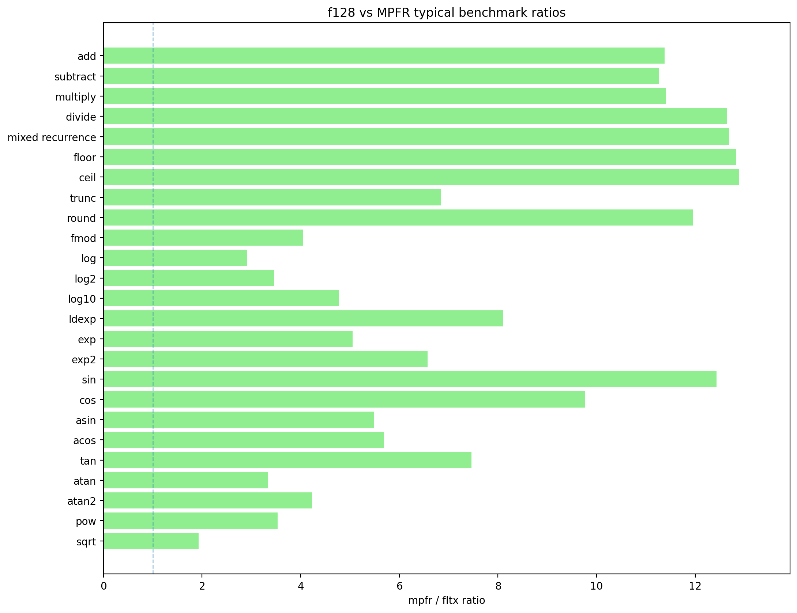
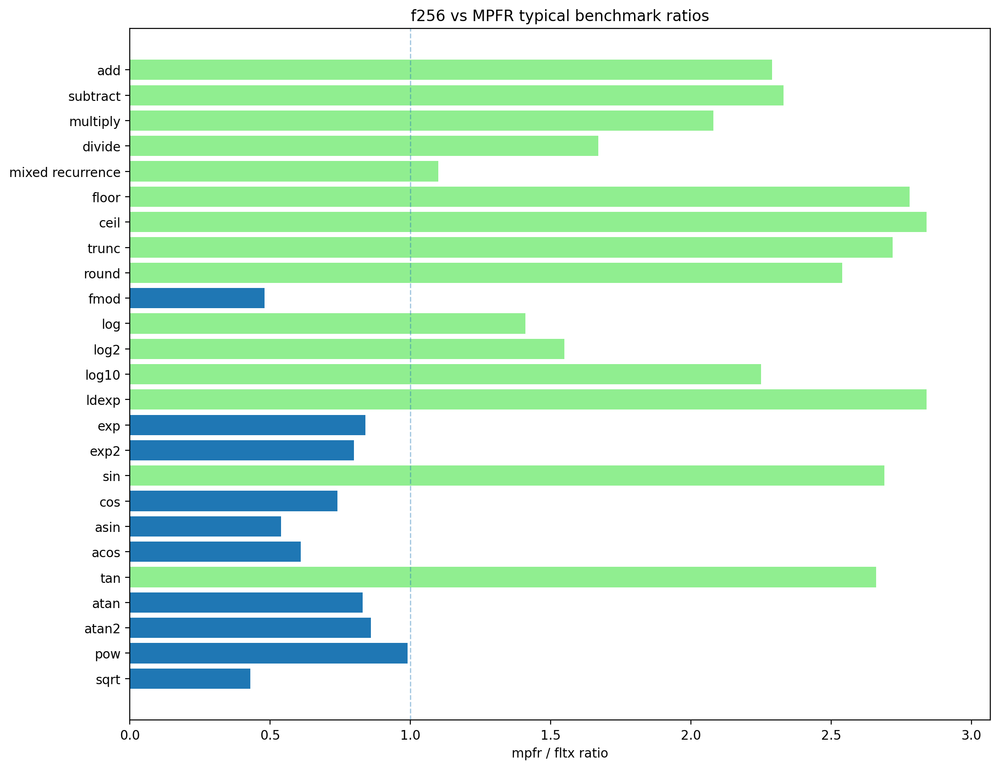

A modern C++ header-only library for fixed-width extended-precision floating-point work.

`fltx` provides numeric types for code that needs **substantially more precision than `double`**, without moving all the way to arbitrary precision.

The core types are:

- **`f128`** — double-double precision, stored as two `double` limbs
- **`f256`** — quad-double precision, stored as four `double` limbs

The goal is simple: **more numerical headroom, `double`-like ergonomics, and strong performance for fixed precision workloads**.

## Highlights

- Header-only modern C++ design
- `f128` and `f256` extended-precision scalar types
- Literal support, operators, conversions, comparisons, and common math functions
- `constexpr` support for arithmetic, math functions, parsing, serialization, classification, and numeric constants
- High-confidence bitwise parity between constexpr and runtime paths in internal tests
- Standard-library integration: `std::ostream`, `std::numeric_limits`, `std::numbers`, and stream manipulators such as `std::setprecision`
- Trivial storage types for low-level layouts, unions, buffers, and interop code
- Optional runtime-to-compile-time dispatch helpers for building type-specialized kernels from runtime settings
- Precision and performance tested against `boost::multiprecision::mpfr_float_backend<digits>`

## Use case

`fltx` is aimed at workloads where **both speed and precision matter**:

- fractals and escape-time systems
- simulations and iterative numerical kernels
- geometric transforms
- numerically sensitive reference code
- constexpr-heavy validation
- experiments where `double` is not enough, but arbitrary precision is overkill

It is a good fit when you want an extended-precision type that can still be passed around like a normal scalar in ordinary C++ code.

## Quick example

```cpp
#include <iostream>
#include <iomanip>

#include <fltx.h>

using namespace bl;
using namespace bl::literals;

int main()
{
    constexpr f256 a = 1_qd / 3_qd;
    constexpr f256 b = 2_qd / 3_qd;
    constexpr f256 c = a + b;

    std::cout << std::setprecision(std::numeric_limits<f256>::digits10)
        << "a = " << a << "\n"
        << "b = " << b << "\n"
        << "a + b = " << c << "\n";
}
```

Output:

```text
a = 0.333333333333333333333333333333333333333333333333333333333333333
b = 0.666666666666666666666666666666666666666666666666666666666666667
a + b = 1
```

## Public includes

You can include the umbrella header when you just want everything:

```cpp
#include <fltx.h>
```

For larger projects, the public headers are split so you can include only the layer you need:

| Header | Use when you want |
|---|---|
| `fltx_types.h` | basic aliases, type concepts, `FloatType`, and small enum helpers |
| `fltx_core.h` | `f128`, `f256`, storage types, core arithmetic, conversions, and standard numeric integration |
| `f128.h` / `f256.h` | only one extended-precision type and its core operations |
| `fltx_math.h` | constexpr-capable math functions for `f32`, `f64`, `f128`, and `f256` |
| `f32_math.h` / `f64_math.h` | constexpr math wrappers for native `float` / `double` |
| `f128_math.h` / `f256_math.h` | math functions for one extended-precision type |
| `fltx_io.h` | parsing, formatting, string conversion, stream output, and literals |
| `f128_io.h` / `f256_io.h` | IO and literals for one extended-precision type |
| `fltx_dispatch.h` | `FloatType` to C++ type dispatch, built on `constexpr_dispatch.h` |
| `constexpr_dispatch.h` | standalone constexpr dispatch machinery for custom runtime-to-template dispatch |

The `fltx_common_*` and exact-decimal headers are implementation/detail headers. Normal user code should not need to include them directly.

## Numeric types

`fltx` has two layers of extended-precision type:

- **full types:** `f128`, `f256`
- **storage types:** `f128_s`, `f256_s`

The full types are the normal user-facing scalar types. They support convenient construction from supported scalar values and are the types most code should use directly.

The storage types are trivial standard-layout types. They are useful for unions, packed layouts, low-level buffers, and places where a simple aggregate representation matters.

```cpp
f128_s a { 5.0 };
f128   b = 5.0f;

f128   c = a + b;
f128_s d = c;
```

After construction, the storage and full types are usable in nearly the same way in normal library code.

The basic aliases and concepts are available from `fltx_types.h`:

```cpp
bl::f32
bl::f64
bl::f128
bl::f256

bl::is_f32_v<T>
bl::is_f64_v<T>
bl::is_f128_v<T>
bl::is_f256_v<T>
bl::is_fltx_v<T>
bl::is_floating_point_v<T>
bl::is_arithmetic_v<T>
```

## Math and IO

`fltx_math.h` gives you a consistent `bl::` math layer across `float`, `double`, `f128`, and `f256`.

That is useful when writing generic kernels where the precision type is a template parameter, but you still want one set of function names:

```cpp
template<class T>
constexpr T radius(T x, T y)
{
    return bl::sqrt(x * x + y * y);
}
```

`fltx_io.h` adds parsing, formatting, stream output, string conversion, and the `_dd` / `_qd` literals:

```cpp
using namespace bl;
using namespace bl::literals;

constexpr f128 a = 1.25_dd;
constexpr f256 b = "3.1415926535897932384626433832795028841971"_qd;

constexpr auto s = bl::to_string(b);
std::string runtime_s = bl::to_std_string(b);
```

## constexpr dispatch

`fltx_dispatch.h` includes a small runtime-to-compile-time dispatch layer.

This is useful when a user setting, file format, UI option, or benchmark parameter chooses the precision at runtime, but the actual kernel should still compile as a type-specialized template.

```cpp
#include <fltx_dispatch.h>

using namespace bl;

template<class T>
void run_kernel(int width, int height)
{
    T scale = T{ 1 } / T{ width + height };
    (void)scale;
}

int main()
{
    FloatType type = FloatType::F256;

    table_invoke(
        dispatch_table(run_kernel, 1920, 1080),
        enum_type(type)
    );
}
```

`enum_type(type)` maps `FloatType::F32`, `FloatType::F64`, `FloatType::F128`, and `FloatType::F256` to `bl::f32`, `bl::f64`, `bl::f128`, and `bl::f256`.

You can also dispatch on enum or bool values as compile-time non-type template arguments, which makes it useful for generating optimized variants of numerical kernels without hand-writing large switch blocks.

## Precision model

`f128` and `f256` are multi-limb floating-point types built from `double` components:

```text
sizeof(f128) == 16
sizeof(f256) == 32
```

The names refer to storage size, not IEEE binary128 or binary256 semantics.

These types give a large precision increase over native `double`, while preserving a familiar floating-point programming model. They are still floating-point approximations, not exact values. Conditioning, cancellation, argument reduction, and algorithm design still matter.

## What fltx is not

`fltx` is **not** an arbitrary-precision library.

It is also not a symbolic math package, decimal arithmetic package, exact rational type, or true IEEE binary128 / binary256 implementation.

If you need unbounded precision, exact rational arithmetic, symbolic manipulation, or decimal semantics, a multiprecision package is still the better tool.

`fltx` is about a different trade-off: **fixed-size extended precision with practical ergonomics and strong performance**.

## vcpkg

Add the bitloop registry to `vcpkg-configuration.json`:

```json
{
  "default-registry": { ... },
  "registries": [
    {
      "kind": "git",
      "baseline": "45fca757b3ddbcbe804ea7d84b3699a469fda448",
      "repository": "https://github.com/willmh93/bitloop-registry.git",
      "packages": ["fltx"]
    }
  ]
}
```

Then add `fltx` to `vcpkg.json`:

```json
{
  "name": "myapp",
  "version": "1.0.0",
  "dependencies": [
    "fltx"
  ]
}
```

## CMake

With vcpkg:

```cmake
find_package(fltx CONFIG REQUIRED)

add_executable(my_app main.cpp)
target_link_libraries(my_app PRIVATE fltx::fltx)
```

Or include it directly:

```cmake
add_executable(my_app main.cpp)
target_include_directories(my_app PRIVATE /path/to/fltx/include)
```

## Test results

`fltx` is tested and benchmarked against `boost::multiprecision::mpfr_float_backend<digits>` at comparable precision levels.




## License

This project is licensed under the MIT Licence.

