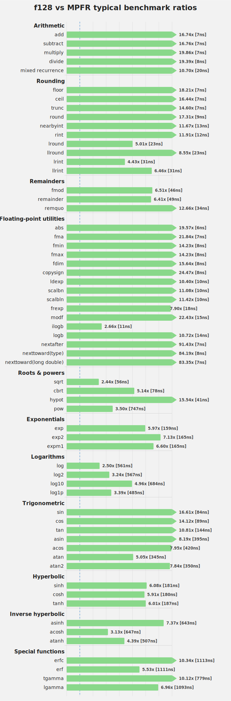
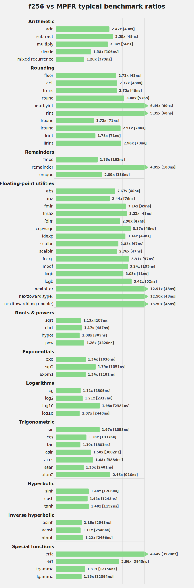

A header-only C++20 library for fixed-width extended-precision floating-point work.

`fltx` is for code that needs more precision than `double`, but still wants fixed-size scalar types, predictable performance, and ordinary C++ ergonomics.

Accuracy and performance are tested against equivalent-precision MPFR, which is used as a reference oracle rather than as the problem `fltx` is trying to replace.

## Highlights

- Fixed-size, pure C++ extended-precision types with no external dependencies, making `fltx` suitable for lightweight native and WebAssembly / Emscripten builds
- Full `constexpr` support for:
  - [`f32`](include/fltx_types.h), [`f64`](include/fltx_types.h), [`f128`](include/f128.h), [`f256`](include/f256.h) arithmetic, operators, conversions, comparisons
  - [`<cmath>`](https://en.cppreference.com/w/cpp/header/cmath)-style API for writing generic numeric code
  - Accurate printing, parsing, formatting: [`bl::to_string`](include/fltx_io.h) / [`bl::to_f128`](include/f128_io.h),  [`bl::to_f256`](include/f256_io.h)
  - Literal support: [`_dd`](include/f128_io.h) / [`_qd`](include/f256_io.h) 
- Standard-library integration:
  - [`std::ostream`](https://en.cppreference.com/w/cpp/io/basic_ostream)
  - [`std::numeric_limits`](https://en.cppreference.com/w/cpp/types/numeric_limits)
  - [`std::numbers`](https://en.cppreference.com/w/cpp/numeric/constants)
  - stream manipulators: [`std::setprecision`](https://en.cppreference.com/w/cpp/io/manip/setprecision), [`std::fixed`](https://en.cppreference.com/cpp/io/manip/fixed), [`std::scientific`](https://en.cppreference.com/cpp/io/manip/fixed), [`std::showpoint`](https://en.cppreference.com/cpp/io/manip/showpoint), [`std::showpos`](https://en.cppreference.com/cpp/io/manip/showpos), [`std::uppercase`](https://en.cppreference.com/cpp/io/manip/uppercase)
- Bitwise runtime/`constexpr` parity for [`f128`](include/f128.h) and [`f256`](include/f256.h) by default; [`f32`](include/fltx_types.h) / [`f64`](include/fltx_types.h) match `std::` performance by default, with optional parity mode via [`FLTX_CONSTEXPR_PARITY`](include/fltx_math.h)
- **Optional:** runtime-to-compile-time dispatch helpers
- Tested and Benchmarked against [`boost::multiprecision::mpfr_float_backend<>`](https://www.boost.org/doc/libs/release/libs/multiprecision/doc/html/boost_multiprecision/tut/floats/mpfr_float.html) at comparable precision
 
## Core types

| Type | Backing representation | Tested accuracy |
|---|---|---|
| [`bl::f32`](include/fltx_types.h) | Alias for native [`float`](https://en.cppreference.com/w/cpp/language/types) | Native [`float`](https://en.cppreference.com/w/cpp/language/types) precision |
| [`bl::f64`](include/fltx_types.h) | Alias for native [`double`](https://en.cppreference.com/w/cpp/language/types) | Native [`double`](https://en.cppreference.com/w/cpp/language/types) precision |
| [`bl::f128`](include/f128.h) | Double-double precision, stored as two [`double`](https://en.cppreference.com/w/cpp/language/types) limbs | Minimum 29 decimal digits across arithmetic and math functions |
| [`bl::f256`](include/f256.h) | Quad-double precision, stored as four [`double`](https://en.cppreference.com/w/cpp/language/types) limbs | Minimum 59 decimal digits across arithmetic and math functions |

## constexpr support

[`fltx_math.h`](include/fltx_math.h) provides a `constexpr`-capable, [`<cmath>`](https://en.cppreference.com/w/cpp/header/cmath)-style API across [`bl::f32`](include/fltx_types.h), [`bl::f64`](include/fltx_types.h), [`bl::f128`](include/f128.h), and [`bl::f256`](include/f256.h); every function listed below is supported for each type.

| Category | Functions |
|---|---|
| ✅ Arithmetic | [`bl::abs`](include/fltx_math.h), [`bl::fma`](include/fltx_math.h) |
| ✅ Rounding | [`bl::floor`](include/fltx_math.h), [`bl::ceil`](include/fltx_math.h), [`bl::trunc`](include/fltx_math.h), [`bl::round`](include/fltx_math.h), [`bl::lround`](include/fltx_math.h), [`bl::llround`](include/fltx_math.h), [`bl::nearbyint`](include/fltx_math.h), [`bl::rint`](include/fltx_math.h), [`bl::lrint`](include/fltx_math.h), [`bl::llrint`](include/fltx_math.h) |
| ✅ Remainders | [`bl::fmod`](include/fltx_math.h), [`bl::remainder`](include/fltx_math.h), [`bl::remquo`](include/fltx_math.h) |
| ✅ Min / max / sign | [`bl::fmin`](include/fltx_math.h), [`bl::fmax`](include/fltx_math.h), [`bl::fdim`](include/fltx_math.h), [`bl::copysign`](include/fltx_math.h) |
| ✅ Roots / powers | [`bl::sqrt`](include/fltx_math.h), [`bl::cbrt`](include/fltx_math.h), [`bl::hypot`](include/fltx_math.h), [`bl::pow`](include/fltx_math.h) |
| ✅ Exp / log | [`bl::exp`](include/fltx_math.h), [`bl::exp2`](include/fltx_math.h), [`bl::expm1`](include/fltx_math.h), [`bl::log`](include/fltx_math.h), [`bl::log2`](include/fltx_math.h), [`bl::log10`](include/fltx_math.h), [`bl::log1p`](include/fltx_math.h), [`bl::logb`](include/fltx_math.h), [`bl::ilogb`](include/fltx_math.h) |
| ✅ Trig | [`bl::sin`](include/fltx_math.h), [`bl::cos`](include/fltx_math.h), [`bl::tan`](include/fltx_math.h), [`bl::asin`](include/fltx_math.h), [`bl::acos`](include/fltx_math.h), [`bl::atan`](include/fltx_math.h), [`bl::atan2`](include/fltx_math.h) |
| ✅ Hyperbolic | [`bl::sinh`](include/fltx_math.h), [`bl::cosh`](include/fltx_math.h), [`bl::tanh`](include/fltx_math.h), [`bl::asinh`](include/fltx_math.h), [`bl::acosh`](include/fltx_math.h), [`bl::atanh`](include/fltx_math.h) |
| ✅ Special | [`bl::erf`](include/fltx_math.h), [`bl::erfc`](include/fltx_math.h), [`bl::lgamma`](include/fltx_math.h), [`bl::tgamma`](include/fltx_math.h) |
| ✅ Scaling / layout | [`bl::ldexp`](include/fltx_math.h), [`bl::scalbn`](include/fltx_math.h), [`bl::scalbln`](include/fltx_math.h), [`bl::frexp`](include/fltx_math.h), [`bl::modf`](include/fltx_math.h), [`bl::nextafter`](include/fltx_math.h), [`bl::nexttoward`](include/fltx_math.h) |
## Use case

`fltx` is aimed at workloads where **both speed and precision matter**:

- simulations and iterative numerical kernels
- geometric transforms
- numerically sensitive reference code
- constexpr-heavy validation

It is a good fit when you want an extended-precision type that can still be passed around like a normal scalar in ordinary C++ code.

## Example

```cpp
#include <iostream>
#include <iomanip>

#include <fltx.h>
using namespace bl;
using namespace bl::literals;

int main()
{
    constexpr f256 a = 1_qd / 3_qd;
    constexpr f256 b = 2_qd / 3_qd;
    constexpr f256 c = a + b;

    std::cout << std::setprecision(std::numeric_limits<f256>::digits10)
        << "a = " << a << "\n"
        << "b = " << b << "\n"
        << "a + b = " << c << "\n";
}
```

Output:

```text
a = 0.333333333333333333333333333333333333333333333333333333333333333
b = 0.666666666666666666666666666666666666666666666666666666666666667
a + b = 1
```

For more, see [examples/](examples/)

## Public headers

| Umbrella Headers | Provides |
|---|---|
| **[`fltx.h`](include/fltx.h)** | full library |
| **[`fltx_core.h`](include/fltx_core.h)** | [`f32`](include/fltx_types.h), [`f64`](include/fltx_types.h), [`f128`](include/f128.h), [`f256`](include/f256.h), storage types ([`f128_s`](include/f128.h), [`f256_s`](include/f256.h))<br>arithmetic, conversions, and standard numeric integration |
| **[`fltx_math.h`](include/fltx_math.h)** | `fltx_core.h` and constexpr-capable **`<cmath>`** interface |
| **[`fltx_io.h`](include/fltx_io.h)** | `fltx_core.h`, `f128_io.h`, `f256_io.h` for parsing, formatting, string conversion, stream output, and literals |

| Individual Headers | Provides |
|---|---|
| **[`f128.h`](include/f128.h)**<br>**[`f256.h`](include/f256.h)** | individual extended-precision types, storage types, and their core operations |
| **[`f32_math.h`](include/f32_math.h)**<br>**[`f64_math.h`](include/f64_math.h)**<br>**[`f128_math.h`](include/f128_math.h)**<br>**[`f256_math.h`](include/f256_math.h)** | constexpr-capable **`<cmath>`** math interface for individual floating-point types |
| **[`f128_io.h`](include/f128_io.h)**<br>**[`f256_io.h`](include/f256_io.h)** | IO and literals for one extended-precision type |
| **[`fltx_types.h`](include/fltx_types.h)** | aliases, concepts, [`FloatType`](include/fltx_types.h), and enum helpers |
| **[`constexpr_dispatch.h`](include/constexpr_dispatch.h)** | standalone constexpr dispatch utility |
| **[`fltx_dispatch.h`](include/fltx_dispatch.h)** | includes `constexpr_dispatch.h`<br>and [`bl::enum_type(FloatType)`](include/fltx_dispatch.h) → [`f32`](include/fltx_types.h), [`f64`](include/fltx_types.h), [`f128`](include/f128.h), [`f256`](include/f256.h) type mapping |

## Numeric types

The main user-facing types are:

```text
bl::f32     // float alias
bl::f64     // double alias
bl::f128    // full double-double type
bl::f256    // full quad-double type

bl::f128_s  // trivial storage form
bl::f256_s  // trivial storage form
```

The trivial storage forms are useful when standard-layout storage matters, such as packed structures, unions, binary buffers, or interop boundaries. They convert cleanly to and from the full scalar types:

```text
f128_s a { 5.0 };
f128   b = 5.0f;

f128   c = a + b;
f128_s d = c;
```

The common type traits are available from `fltx_types.h`:

```cpp
bl::is_f32_v<T>
bl::is_f64_v<T>
bl::is_f128_v<T>
bl::is_f256_v<T>

bl::is_fltx_v<T>
bl::is_floating_point_v<T>
bl::is_arithmetic_v<T>
```

## IO and literals

[`fltx_io.h`](include/fltx_io.h) adds `constexpr`-capable parsing, formatting, stream output, string conversion, and the [`_dd`](include/f128_io.h) / [`_qd`](include/f256_io.h) literals:
```cpp
using namespace bl;
using namespace bl::literals;

constexpr f128 a = 1.25_dd;
constexpr f256 b = "3.1415926535897932384626433832795028841971"_qd;

constexpr auto s1 = bl::to_string(b);      // static_string<512>
std::string s2    = bl::to_std_string(b);
```

## Math

[`fltx_math.h`](include/fltx_math.h) provides a `<cmath>`-style API for [`bl::f32`](include/fltx_types.h), [`bl::f64`](include/fltx_types.h), [`bl::f128`](include/f128.h), and [`bl::f256`](include/f256.h).

This lets generic numeric code switch precision without changing its math calls:
```cpp
template<class T>
constexpr T radius(T x, T y)
{
    return bl::sqrt(x * x + y * y);
}

constexpr f32   a = radius(1.0f, 2.0f);
constexpr f64   b = radius(1.0,  2.0);
constexpr f128  c = radius(1.0_dd, 2.0_dd);
constexpr f256  d = radius(1.0_qd, 2.0_qd);
```

## constexpr dispatch

[`fltx_dispatch.h`](include/fltx_dispatch.h) includes a small runtime-to-compile-time dispatch layer.

This lets runtime values such as [`FloatType::F128`](include/fltx_types.h) or [`FloatType::F256`](include/fltx_types.h) select a compile-time `T`, so the called function still compiles as a normal template specialization.

```cpp
#include <iostream>
#include <fltx.h>
using namespace bl;

template<class T>
void run_kernel(int width, int height)
{
    T x = T{ width } / T{ height };
    T y = bl::sqrt(x) + bl::sin(x);

    std::cout << y << '\n';
}

int main()
{
    FloatType precision = FloatType::F256;

    table_invoke(
        dispatch_table(run_kernel, 1920, 1080), // binds the function and arguments into a dispatch table
        enum_type(precision) // selects the compile-time type mapped from the runtime FloatType value
    );
}
```

<details>
<summary>Example: mapping a custom enum to a compile-time type</summary>

[`constexpr_dispatch.h`](include/constexpr_dispatch.h) is the lower-level dispatch utility used by [`fltx_dispatch.h`](include/fltx_dispatch.h). It can also be used directly when you want your own runtime enum to select one of several compile-time types:

```cpp
#include <constexpr_dispatch.h>

enum struct Backend { Cpu, Gpu, COUNT }; // COUNT is required to determine the dispatch domain size

struct CpuBackend {};
struct GpuBackend {};

bl_map_enum_to_type(Backend::Cpu, CpuBackend);
bl_map_enum_to_type(Backend::Gpu, GpuBackend);

template<class BackendT, bool Debug>
void run()
{
    if constexpr (Debug)
    {}
}

int main()
{
    Backend backend = Backend::Gpu;
    bool debug = true;

    bl::table_invoke(
        bl::dispatch_table(run),
        bl::enum_type(backend),
        debug
    );
}
```
</details>

## Precision model

[`bl::f128`](include/f128.h) and [`bl::f256`](include/f256.h) are fixed-width, multi-limb floating-point types built from `double` components:

```text
sizeof(f128) == 16
sizeof(f256) == 32
```

The names refer to storage size. They are not IEEE [binary128](https://en.wikipedia.org/wiki/Quadruple-precision_floating-point_format#IEEE_754_quadruple-precision_binary_floating-point_format:_binary128) / [binary256](https://en.wikipedia.org/wiki/Octuple-precision_floating-point_format#IEEE_754_octuple-precision_binary_floating-point_format:_binary256) types, and they are not [arbitrary-precision](https://en.wikipedia.org/wiki/Arbitrary-precision_arithmetic) numbers.

`fltx` gives you more precision than native double while keeping a familiar floating-point model. Values are still approximate, so conditioning, cancellation, argument reduction, and algorithm design still matter.

## vcpkg

Add the bitloop registry to `vcpkg-configuration.json`:

```json
{
  "default-registry": { ... },
  "registries": [
    {
      "kind": "git",
      "baseline": "45fca757b3ddbcbe804ea7d84b3699a469fda448",
      "repository": "https://github.com/willmh93/bitloop-registry.git",
      "packages": ["fltx"]
    }
  ]
}
```

Then add `fltx` to `vcpkg.json`:

```json
{
  "name": "myapp",
  "version": "1.0.0",
  "dependencies": [
    "fltx"
  ]
}
```

## CMake

With vcpkg:

```cmake
find_package(fltx CONFIG REQUIRED)
target_link_libraries(main PRIVATE fltx::fltx)
```

Or include it directly:

```cmake
target_include_directories(main PRIVATE /path/to/fltx/include)
```

## Benchmarks

`fltx` is tested and benchmarked against [`boost::multiprecision::mpfr_float_backend<>`](https://www.boost.org/doc/libs/release/libs/multiprecision/doc/html/boost_multiprecision/tut/floats/mpfr_float.html) at comparable precision levels.

<table><tr>
<td></td>
<td></td>
</tr></table>

## License

This project is licensed under the MIT Licence.
